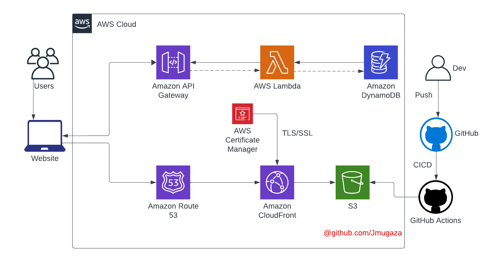

# AWS Cloud Resume Challenge

## Overview

This project deploys a static resume website hosted on Amazon S3, secured with HTTPS using Amazon CloudFront, and accessible via a custom domain registered on Amazon Route 53. The website includes a visitor counter powered by AWS Lambda, backed by Amazon DynamoDB, and utilizes AWS API Gateway for communication between the frontend and backend. The architecture follows Infrastructure as Code (IaC) principles, using Terraform to define and provision AWS resources.

## Architecture

## AWS Services and Tools Used

AWS services and tools to achieve its functionality and infrastructure management:

- **Amazon S3**: Hosts the static website content and assets.
- **Amazon CloudFront**: Provides HTTPS security and content distribution.
- **Amazon Route 53**: Manages DNS and routes traffic to CloudFront.
- **Amazon DynamoDB**: Stores visitor count data.
- **AWS Lambda**: Executes serverless functions for the visitor counter.
- **AWS API Gateway**: Serves as the interface to Lambda functions.
- **Amazon Certificate Manager (ACM)**: Manages SSL/TLS certificates for HTTPS encryption.
- **AWS IAM (Identity and Access Management)**: Manages permissions and access control.
- **Terraform**: Used for Infrastructure as Code (IaC) to define and provision AWS resources.
- **GitHub Actions**: Automates continuous integration and deployment (CI/CD) workflows.

## [Live Demo](https://jeilanim.com/)

## Developer

- [Jeilani](https://www.linkedin.com/in/j-mugaza)
